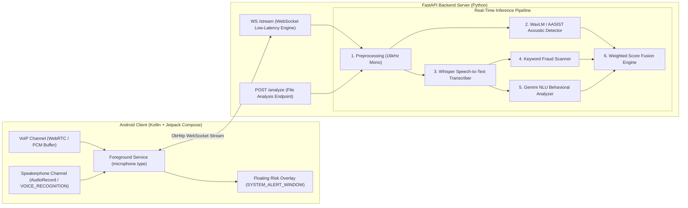

# 🛡️ Dhvani Rakshak (Dhvani Defender)
### Real-Time AI Voice Clone & Deepfake Fraud Prevention Gateway (VoIP + Speakerphone Integration)

---

## 📌 Architectural Overview

Dhvani Rakshak is an enterprise AI voice clone detection and fraud deflection engine built for dual-channel audio acquisition:



---

## 📂 Project Directory Structure

```text
Dhvani Rakshak Root
├── backend/                             ├── frontend/
│   ├── core/                            │   ├── android/
│   │   ├── acoustic_analyzer.py         │   │   ├── app/src/main/java/com/dhvanirakshak/app/
│   │   ├── alert_service.py             │   │   │   ├── audio/
│   │   ├── audio_ingestion.py           │   │   │   │   ├── SpeakerphoneRecorder.kt
│   │   ├── behavioral_biometrics.py     │   │   │   │   └── VoipAudioEngine.kt
│   │   ├── blockchain_certifier.py      │   │   │   ├── service/
│   │   ├── call_store.py                │   │   │   │   └── CallAudioService.kt
│   │   ├── content_intent_analyzer.py   │   │   │   ├── CallDetectionService.java
│   │   ├── context_enricher.py          │   │   │   ├── FloatingRiskOverlay.java
│   │   ├── keyword_scanner.py           │   │   │   └── MainActivity.java
│   │   ├── prosody_analyzer.py          │   │   ├── build.gradle.kts
│   │   ├── risk_scorer.py               │   │   └── settings.gradle
│   │   ├── scoring_fusion.py            │   └── src/
│   │   └── speaker_verifier.py          │       ├── components/
│   ├── telecom/                         │       │   ├── CallSimulator.jsx
│   │   ├── codecs.py                    │       │   ├── LiveMonitor.jsx
│   │   └── telecom_gateway.py           │       │   └── TelecomGateway.jsx
│   ├── audio_samples/                   │       ├── App.jsx
│   │   ├── human_genuine.wav            │       └── main.jsx
│   │   ├── elevenlabs_ai_clone.wav      ├── docker-compose.yml
│   │   └── spliced_attack.wav           ├── Dockerfile
│   ├── main.py                          ├── Dhvani_Rakshak.postman_collection.json
│   └── requirements.txt                 └── README.md
```

---

## ⚡ Quick Start & Setup Guide

### 1. Run Backend Server (Python FastAPI)

```bash
# Navigate to project root
cd "Dhvani Rakshak"

# Install dependencies
pip install -r requirements.txt

# Start backend server
python backend/main.py
```
Backend API will be running on `http://localhost:8000`.

### 2. Run with Docker Compose

```bash
docker-compose up --build
```

### 3. Run Frontend Web Client

```bash
cd frontend
npm install
npm run dev
```
Frontend web app will be available at `http://localhost:5173`.

### 4. Build Android Application

Open `frontend/android` in **Android Studio** and click **Build & Run** on emulator or physical device.

---

## 🧮 Score Fusion & Decision Rules

$$\text{Final Risk Score} = (0.60 \times \text{WavLM Score}) + (0.25 \times \text{Gemini Score}) + (0.15 \times \text{Keyword Score})$$

- **🚨 RED Alert ($\ge 85$ or AI Voice + Fraud Keywords):**
  - *"AI voice + fraud keywords detected. Recommended: hang up and verify via callback."*
- **⚠️ YELLOW Alert ($60 - 84$):**
  - *"AI voice detected, but content appears benign."* OR *"Possible social engineering attempt by human caller."*
- **✅ GREEN Alert ($< 60$):**
  - *"Authentic real human voice."*

---

## 🧪 Testing Backend Endpoints

Import `Dhvani_Rakshak.postman_collection.json` into Postman to test:
- `POST http://localhost:8000/analyze`
- `WS ws://localhost:8000/stream`
- `POST http://localhost:8000/enroll`
- `POST http://localhost:8000/verify`
- `GET http://localhost:8000/health`
