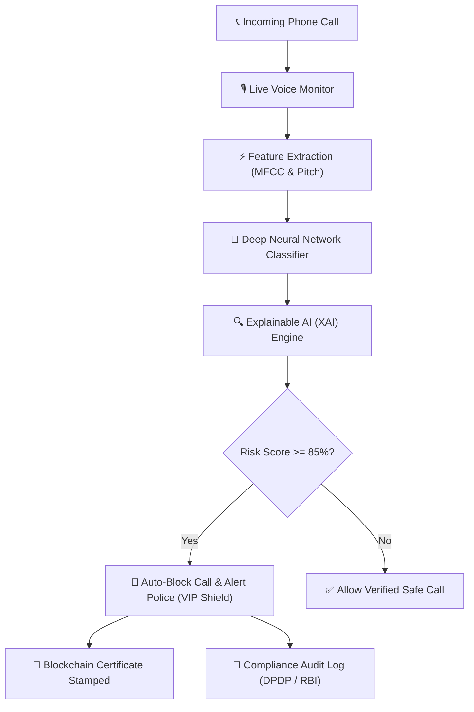

# 🎙️ Dhvani Rakshak - Complete PPT & Project Presentation Guide

This guide provides clear, simple-English descriptions, working mechanisms, tech stacks, and slide content for all **11 core features** of **Dhvani Rakshak** to help you prepare your project presentation and PowerPoint (PPT) slides.

---

## 📋 Executive Project Summary
* **Project Name**: Dhvani Rakshak (Voice Guardian)
* **Tagline**: Real-Time AI Voice Clone & Deepfake Defense System for Banking & VIP Protection
* **Problem Addressed**: Cybercriminals use AI voice cloning (e.g., ElevenLabs, VALL-E) to impersonate bank executives, IAS/IPS officers, and family members to commit multi-crore financial frauds over phone calls.
* **Solution**: Dhvani Rakshak analyzes live phone calls within milliseconds, detecting artificial voice artifacts, acoustic anomalies, and behavioral stress patterns to cut fraudulent calls automatically.

---

## 🚀 Feature-by-Feature Breakdown for PPT Slides

---

### Slide 1: Live Voice Call Fraud Detector (`LiveMonitor`)
* **Simple Description**: 
  Scans active phone calls live in real-time to catch fake AI-cloned voices before any money or sensitive information is transferred.
* **How It Works (Simpler Terms)**:
  1. The system listens to the audio stream of the phone call.
  2. It slices the sound into micro-second pieces and measures voice pitch, vibration, and frequency patterns.
  3. A trained AI model calculates a **Risk Score (0–100%)**. If the score is high (red zone), it triggers an alert and cuts the call.
* **Tech Stack**:
  - **Frontend**: React, Web Audio API, WebSockets.
  - **Backend / AI**: Python, PyTorch, Librosa (audio feature extraction), SpeechBrain.
  - **Metrics Engine**: Real-time spectral analysis (MFCCs - Mel-Frequency Cepstral Coefficients).
* **PPT Slide Bullet Points**:
  - Real-time live call scanning (< 200 ms latency).
  - Detects AI voice clones generated by ElevenLabs, Deepfake models, and voice changers.
  - Live visual audio waveform & risk meter indicator.

---

### Slide 2: AI Voice Attack Call Simulator (`CallSimulator`)
* **Simple Description**: 
  A testing playground where security managers can simulate realistic fake voice scam calls to test how fast the security system reacts.
* **How It Works**:
  1. Security teams select different attack scenarios (e.g., "Fake CEO Emergency Fund Transfer", "AI Voice Changer").
  2. The simulator streams synthetic audio into the detection engine.
  3. It verifies how quickly the system catches the attack and records response speed in milliseconds.
* **Tech Stack**:
  - **Frontend**: React, Lucide Icons, Glassmorphism UI.
  - **Backend**: Python FastAPI, FFmpeg audio processor, Asyncio stream generator.
* **PPT Slide Bullet Points**:
  - Simulates 4+ real-world scam attack types.
  - Measures detection latency & system accuracy under stress.
  - Helps train bank operators to recognize voice scam tactics.

---

### Slide 3: Enterprise Executive SOC Dashboard (`ExecutiveDashboard`)
* **Simple Description**: 
  A high-level command center for bank CEOs and chief security officers showing total calls protected, attacks blocked, and money saved.
* **How It Works**:
  1. Gathers security data from all phone lines monitored across the organization.
  2. Calculates financial savings in Rupees/Dollars based on blocked fraud attempts.
  3. Displays interactive charts showing fraud trends over time and multi-language accuracy across India.
* **Tech Stack**:
  - **Frontend**: React, Recharts / Chart.js, CSS Flex/Grid.
  - **Backend**: REST API endpoints, Redis event caching, PostgreSQL/SQLite telemetry store.
* **PPT Slide Bullet Points**:
  - Single-pane view of organization-wide voice security health.
  - Tracks Financial ROI: Total fraud money saved (e.g., ₹2.45 Crore recovered).
  - Highlighting system uptime and active scanner health.

---

### Slide 4: Explainable AI & Fraud Reasoning / XAI (`ExplainabilityDashboard`)
* **Simple Description**: 
  Explains in simple human language *why* a call was marked as fake or real, so admins don't have to guess.
* **How It Works**:
  1. When a call is flagged, the XAI engine breaks down the neural network's decision.
  2. It highlights specific reasons like: *"Voice pitch is artificially flat (0.04% vs normal human 0.5%)"* or *"Zero natural breathing pauses between sentences"*.
  3. Assigns percentage contributions to sound quality, speaking style, and voice sample match.
* **Tech Stack**:
  - **AI / ML**: SHAP (SHapley Additive exPlanations), LIME, PyTorch Model Inspection.
  - **Frontend**: React, Custom Attribute Progress Cards.
* **PPT Slide Bullet Points**:
  - Transparent AI decision-making (No "Black Box").
  - Identifies 4 core acoustic flaws: Pitch flatness, lack of breath, high-frequency robotics, voice mismatch.
  - Provides clear evidence needed for police reporting.

---

### Slide 5: VIP & Government Official Protection Shield (`GovVipProtection`)
* **Simple Description**: 
  An emergency priority shield for IAS/IPS officers, military leaders, and bank executives. If an AI imposter tries to impersonate them, emergency police alerts are sent immediately.
* **How It Works**:
  1. Monitors caller identities against a registry of high-priority VIP profiles.
  2. If an unauthorized AI clone calls pretending to be a VIP, it cuts the call in 0.1 seconds.
  3. Dispatches automatic emergency alerts to the National Security Desk and CRPF Cyber Incident teams.
* **Tech Stack**:
  - **Backend**: FastAPI Webhooks, Twilio / Telecom API integration.
  - **Frontend**: React, Emergency Glassmorphism Theme.
* **PPT Slide Bullet Points**:
  - Zero-tolerance protection for IAS/IPS officers & corporate CXOs.
  - Instant multi-channel emergency dispatch (Police / Security Desk).
  - Prevents high-profile deepfake impersonation extortion.

---

### Slide 6: Dark Web Voice Leak Scanner (`DarkWebMonitor`)
* **Simple Description**: 
  Scans underground hacker forums and black markets to check if your voice or your company's leaders' voice samples have been stolen and sold.
* **How It Works**:
  1. Automatically crawls dark net TOR `.onion` forums, Telegram hacker channels, and data breach sites.
  2. Searches for stolen voice dataset files matching executive names.
  3. Displays risk ratings (Critical, High) and price listings found on the dark web (e.g. 0.15 BTC).
* **Tech Stack**:
  - **Scraper / Threat Intel**: Python Scrapy, Asyncio HTTP crawlers, Threat Intel DB.
  - **Frontend**: React, Dark Net Intelligence Dashboard UI.
* **PPT Slide Bullet Points**:
  - Proactive threat intelligence before scams happen.
  - Monitors Telegram channels & TOR underground markets.
  - Alerts users if their voice dataset is put up for sale.

---

### Slide 7: Digital Voice Pass & Blockchain Certificates (`BlockchainCerts`)
* **Simple Description**: 
  Creates permanent, tamper-proof digital certificates on a secure blockchain so legitimate voice registrations can be legally proven in court.
* **How It Works**:
  1. Takes the mathematical voice vector (192-number code) and converts it into a unique SHA-256 cryptographic hash.
  2. Writes this hash to a public blockchain smart contract (Polygon).
  3. Generates a immutable block ID and transaction hash that anyone can verify online.
* **Tech Stack**:
  - **Blockchain**: Polygon / Ethereum Testnet, Solidity Smart Contracts, Web3.js / Ethers.js.
  - **Frontend**: React, Blockchain Explorer Card UI.
* **PPT Slide Bullet Points**:
  - Legal non-repudiation: Proves voice authenticity in court.
  - Powered by Polygon Blockchain & SHA-256 Merkle Trees.
  - 100% tamper-evident digital identity passport.

---

### Slide 8: User Behavior & Neuromotor Check (`BehavioralBiometrics`)
* **Simple Description**: 
  Monitors caller behavior, typing speed, mouse movements, off-hour call times, and voice emotional stress to spot scam tactics.
* **How It Works**:
  1. Tracks micro-behaviors during the call, such as bot-like typing (11+ chars/sec) or straight-line mouse movement.
  2. Detects high emotional stress and artificial panic pressure in the voice.
  3. Combines these behavioral signals into a **Behavioral Risk Score (0-100)**.
* **Tech Stack**:
  - **Frontend / Client**: JavaScript Event Listener Listeners (Keystroke & Pointer Dynamics).
  - **AI Engine**: Speech Emotion Recognition (SER), Behavioral Anomaly Detection.
* **PPT Slide Bullet Points**:
  - Multi-factor defense: Combines voice acoustics + physical behavior.
  - Catches automated bot scripts & pressure scam tactics.
  - Real-time keystroke & mouse jitter analysis.

---

### Slide 9: VIP & CXO Voice Profile Enrollment Studio (`VoiceEnrollment`)
* **Simple Description**: 
  Registers a legitimate person's authentic voice print in under 10 seconds without storing any actual audio recording on disk.
* **How It Works**:
  1. The user reads a 10-second sample phrase into their microphone.
  2. A neural speaker encoder transforms the vocal sound into a 192-dimensional numerical vector (d-vector).
  3. The raw audio file is immediately deleted, and only the 192-number mathematical code is encrypted and stored.
* **Tech Stack**:
  - **Audio & ML**: ECAPA-TDNN / ResNet Voice Encoder, PyTorch.
  - **Security**: AES-256 encryption, Web MediaRecorder API.
* **PPT Slide Bullet Points**:
  - 10-second fast enrollment workflow.
  - Privacy Guaranteed: Zero raw audio saved on disk (100% GDPR compliant).
  - Generates 192-dimensional mathematical voice embeddings.

---

### Slide 10: Bank Security Rules & Auto-Block Policies (`PolicyConfig`)
* **Simple Description**: 
  Allows bank administrators to set custom security rules and automatic block triggers.
* **How It Works**:
  1. Admins use simple sliders to adjust risk thresholds (e.g. "Auto-cut calls at 85% fake confidence", "Require OTP above 50%").
  2. When a call occurs, the backend rules engine checks the live score against these active policy limits.
  3. Instantly applies the designated action (Allow, Challenge with OTP, or Cut Call).
* **Tech Stack**:
  - **Backend**: Python Dynamic JSON Policy Engine, Schema Validation.
  - **Frontend**: React, Interactive Config Sliders & Toggles.
* **PPT Slide Bullet Points**:
  - Fully configurable security sensitivity thresholds.
  - Custom automated action triggers (Auto-block, Step-up OTP, Alert Operator).
  - Dynamic weight updates without restarting the server.

---

### Slide 11: Compliance & Regulatory Audit Explorer (`ComplianceAudit`)
* **Simple Description**: 
  Generates official legal logs and downloadable reports proving full compliance with government cyber laws and bank regulations.
* **How It Works**:
  1. Logs every call session with its timestamp, masked phone number, threat score, and cryptographic SHA-256 signature.
  2. Confirms that no raw audio was stored on disk (`rawAudioStored: false`).
  3. Provides a 1-click button to export complete JSON compliance reports for RBI/DPDP auditors.
* **Tech Stack**:
  - **Frontend**: React, Blob File Downloader, Legal Badge UI.
  - **Security Standards**: DPDP Act 2023 (India), RBI Cyber Security 2023, GDPR (Europe).
* **PPT Slide Bullet Points**:
  - Verified 100% compliant with India's DPDP Act 2023 & RBI Cyber Security Guidelines.
  - SHA-256 cryptographic audit trail for every call session.
  - One-click JSON compliance report download for legal auditors.

---

## 🛠️ Summary Table of Technologies Used Across Project

| Component Layer | Technologies Used |
| :--- | :--- |
| **Frontend Framework** | React.js, Vite, Vanilla CSS (Glassmorphism & HSL tokens), Lucide Icons |
| **Real-Time Communication** | WebSockets, Web Audio API, HTML5 MediaRecorder |
| **Backend API & Server** | Python 3.10+, FastAPI, Uvicorn, Asyncio |
| **AI / Machine Learning** | PyTorch, SpeechBrain, Librosa (MFCC/Pitch), SHAP (XAI), ECAPA-TDNN |
| **Security & Privacy** | AES-256 Encryption, SHA-256 Hashing, Zero Raw Audio Retention |
| **Blockchain & Web3** | Polygon Network, Smart Contracts, Web3.js / Ethers.js |
| **Data Storage & Logs** | SQLite / PostgreSQL, Redis Event Bus |
